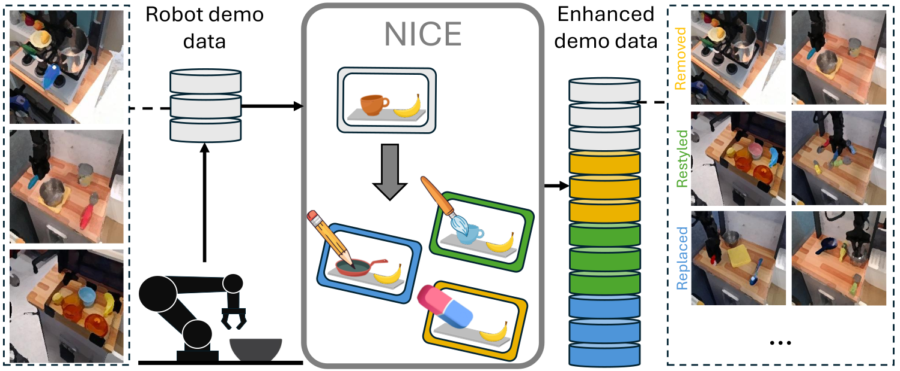
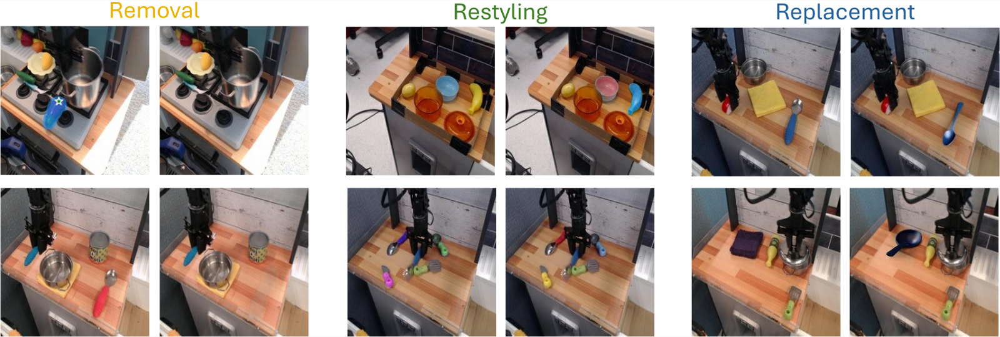

<div align="center">

# Improving Robotic Manipulation Robustness via NICE Scene Surgery

**Preprint**

**Sajjad Pakdamansavoji**, Mozhgan Pourkeshavarz, Adam Sigal, Zhiyuan Li, Rui Heng Yang, Amir Rasouli

Huawei Technologies Canada

[](https://arxiv.org/abs/2511.22777)
[](https://sajjadpsavoji.github.io/NICE-Scene-Surgery/)
[](https://huggingface.co/papers/2511.22777)
[](LICENSE)

</div>



---

> **Note**
> This repository is a placeholder. The paper and project page are live; **code release is in progress**.
> Watch or star the repo to be notified when it lands.

## Summary

Creates new robot training data by editing existing demonstrations — removing, restyling, and replacing distractor objects — so manipulation policies stay robust to clutter without collecting more robot data.

## Key Contributions

- A scene-level editing framework performing three operations — object replacement, restyling, and removal of non-target objects — using image generative models together with large language models.
- Edits preserve spatial relationships and never obstruct target objects, keeping action labels valid, so no new action generation or teleoperation is required.
- Realism validated against real-world counterparts on both background consistency and overall generation quality.
- Demonstrated gains in visual affordance prediction across varying levels of clutter.
- Real-world validation of policy robustness and safety across tasks and distractor counts.

## Abstract

Learning robust visuomotor policies for robotic manipulation remains a challenge in real-world settings, where visual distractors can significantly degrade performance and safety. In this work, we propose an effective and scalable framework, Naturalistic Inpainting for Context Enhancement (NICE). Our method minimizes out-of-distribution (OOD) gap in imitation learning by increasing visual diversity through construction of new experiences using existing demonstrations. By utilizing image generative frameworks and large language models, NICE performs three editing operations, object replacement, restyling, and removal of distracting (non-target) objects. These changes preserve spatial relationships without obstructing target objects and maintain action-label consistency. Unlike previous approaches, NICE requires no additional robot data collection, simulator access, or custom model training, making it readily applicable to existing robotic datasets. Using real-world scenes, we showcase the capability of our framework in producing photo-realistic scene enhancement. For downstream tasks, we use NICE data to finetune a vision-language model (VLM) for spatial affordance prediction and a vision-language-action (VLA) policy for object manipulation. Our evaluations show that NICE successfully minimizes OOD gaps, resulting in over 20% improvement in accuracy for affordance prediction in highly cluttered scenes. For manipulation tasks, success rate increases on average by 11% when testing in environments populated with distractors in different quantities. Furthermore, we show that our method improves visual robustness, lowering target confusion by 6%, and enhances safety by reducing collision rate by 7%.

## News

- **2026-09** &mdash; Paper released on [arXiv](https://arxiv.org/abs/2511.22777) and indexed on [Hugging Face](https://huggingface.co/papers/2511.22777).
- **2026-09** &mdash; Project page live at [sajjadpsavoji.github.io/NICE-Scene-Surgery](https://sajjadpsavoji.github.io/NICE-Scene-Surgery/).

## Getting Started

_Code coming soon._ The intended entry point:

```bash
git clone https://github.com/SajjadPSavoji/NICE-Scene-Surgery.git
cd NICE-Scene-Surgery
pip install -r requirements.txt
```

## Results



- Generates scenes realistic enough to significantly improve robot perception and downstream manipulation.
- Improves policy robustness in environments populated with varying numbers of distractors.
- Requires **no additional robot data collection** and minimal human involvement.

## Citation

If you find this work useful, please cite:

```bibtex
@article{pakdamansavoji2025improving,
  title   = {Improving Robotic Manipulation Robustness via NICE Scene Surgery},
  author  = {Sajjad Pakdamansavoji and Mozhgan Pourkeshavarz and Adam Sigal and Zhiyuan Li and Rui Heng Yang and Amir Rasouli},
  journal = {arXiv preprint arXiv:2511.22777},
  year    = {2025}
}
```

## Links

- 📄 [Paper (arXiv)](https://arxiv.org/abs/2511.22777)
- 🌐 [Project page](https://sajjadpsavoji.github.io/NICE-Scene-Surgery/)
- 🤗 [Hugging Face](https://huggingface.co/papers/2511.22777)
- 👤 [Google Scholar](https://scholar.google.com/citations?user=DZzLzNwAAAAJ)
- 💼 [LinkedIn](https://www.linkedin.com/in/sajjad-pakdaman-savoji/)
- ✉️ [sj.pakdaman.edu@gmail.com](mailto:sj.pakdaman.edu@gmail.com)

## Contact

For questions about the paper, data, or code release, contact
**Sajjad Pakdamansavoji** &mdash; [sj.pakdaman.edu@gmail.com](mailto:sj.pakdaman.edu@gmail.com).

## Acknowledgements

†Corresponding author · *Work done while at Huawei Canada

## License

Released under the [MIT License](LICENSE).
